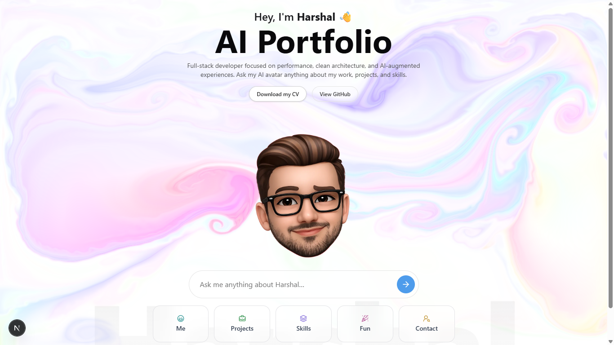
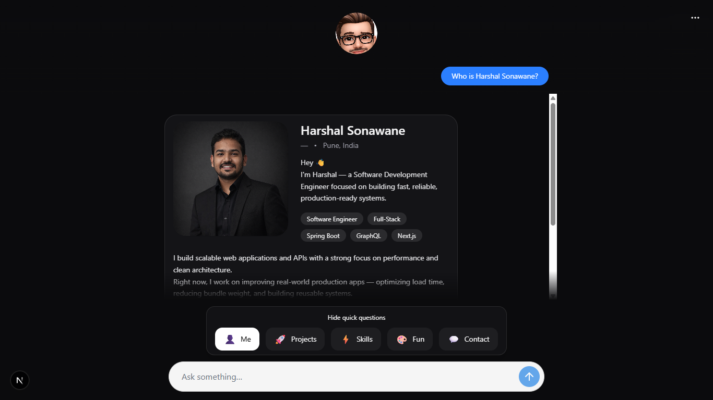
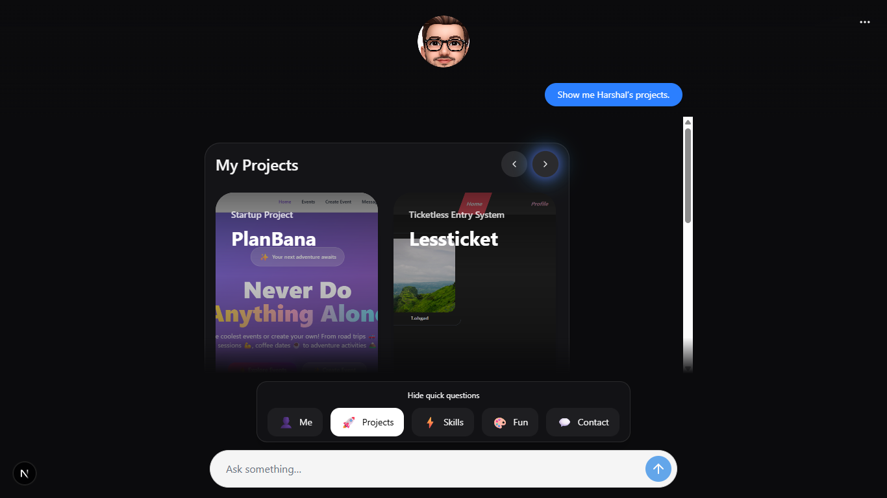

# 🚀 Portfolio AI - Interactive Next.js Portfolio with AI Chat

A modern, interactive portfolio website built with Next.js featuring an intelligent AI chatbot, fluid animations, and seamless project showcases. This portfolio combines cutting-edge web technologies with AI-powered interactions to create an engaging way to explore projects and learn about the developer.

## 📸 Screenshot Placeholders

### Home Page


_Screenshot coming soon_

### AI Chat Interface


_Screenshot coming soon_

### Projects Showcase


_Screenshot coming soon_

---

## ✨ Key Features

### 🤖 AI-Powered Chat

- **Intelligent Chatbot**: Powered by GPT-4 via OpenAI API for dynamic conversations
- **Resume RAG (Retrieval Augmented Generation)**: Chat bot understands your resume and can answer questions about your experience
- **Real-time Responses**: Streaming responses for natural conversation flow
- **Smart Context**: AI understands project details and can provide insights about your work

### 🎨 Modern UI/UX

- **Fluid Cursor Effects**: Custom animated cursor for enhanced visual feedback
- **Smooth Animations**: Framer Motion animations for polished transitions
- **Dark Mode Support**: Theme switching with next-themes
- **Responsive Design**: Mobile-first design that works on all screen sizes
- **Particle Effects**: TSParticles for dynamic background animations

### 📱 Project Showcase

- **Project Gallery**: Showcase multiple projects with screenshots and descriptions
- **Interactive Details**: View project information, technologies used, and live demos
- **Organized Structure**: Projects organized in the public folder for easy access

### 🚀 Performance

- **Next.js 15**: Latest React framework for optimal performance
- **TypeScript**: Type-safe codebase for reliability
- **Tailwind CSS**: Utility-first CSS for efficient styling
- **Vercel Analytics**: Track user engagement

---

## 🛠️ Tech Stack

### Frontend

- **Framework**: Next.js 15.2.3
- **React**: 19.0.0
- **Language**: TypeScript 5
- **Styling**: Tailwind CSS 4 + PostCSS
- **UI Components**: Radix UI
- **Animations**: Framer Motion, Motion, TSParticles

### AI & Backend

- **AI Integration**: Vercel AI SDK (@ai-sdk)
- **LLM**: OpenAI GPT-4
- **PDF Processing**: pdf-parse, pdfjs-dist (for resume parsing)
- **RAG**: Custom resume RAG implementation

### UI Libraries

- **Icons**: Lucide React, Radix UI Icons, Tabler Icons
- **3D Icons**: Lord Icon React
- **Toast Notifications**: Sonner
- **Markdown**: React Markdown with GFM support

### Development & Tools

- **Package Manager**: pnpm
- **ESLint**: Code quality & linting
- **Prettier**: Code formatting
- **Build Tools**: Next.js build system

---

## 📁 Project Structure

```
.
├── src/
│   ├── app/
│   │   ├── api/
│   │   │   ├── harshal-chat/        # AI chat endpoint
│   │   │   └── project-screenshots/ # Screenshot handler
│   │   ├── chat/                    # Chat page
│   │   ├── layout.tsx               # Root layout
│   │   ├── page.tsx                 # Home page
│   │   ├── globals.css              # Global styles
│   │   └── glob.css                 # Additional global styles
│   ├── components/
│   │   ├── chat/                    # Chat components
│   │   │   ├── chat.tsx             # Main chat component
│   │   │   └── chat-bottombar.tsx   # Chat input area
│   │   ├── ui/                      # UI components
│   │   ├── theme-provider.tsx       # Theme context
│   │   └── FluidCursor.tsx          # Cursor effect component
│   ├── hooks/
│   │   ├── use-harshal-chat.ts      # Chat hook
│   │   ├── use-fastfolio-chat.ts    # FastAPI chat hook
│   │   ├── use-FluidCursor.tsx      # Cursor effect hook
│   │   └── use-outside-click.tsx    # Click outside hook
│   ├── lib/
│   │   ├── harshal-knowledge.ts     # Knowledge base system
│   │   ├── harshalAiClient.ts       # AI client setup
│   │   ├── utils.ts                 # Utility functions
│   │   └── rag/
│   │       └── resumeRag.ts         # Resume RAG implementation
│   └── data/
│       └── content.ts               # Static content & metadata
├── public/
│   └── projects/                    # Project screenshots & assets
│       ├── dsa/
│       ├── fintrackr/
│       ├── handpose-tank/
│       ├── lessticket/
│       ├── planbana/
│       └── portfolio/
├── package.json                     # Dependencies
├── next.config.ts                   # Next.js configuration
├── tsconfig.json                    # TypeScript configuration
├── tailwind.config.mjs              # Tailwind CSS config
├── postcss.config.mjs               # PostCSS configuration
├── eslint.config.mjs                # ESLint rules
├── components.json                  # Component configuration
└── README.md                        # This file
```

---

## 🚀 Getting Started

### Prerequisites

- **Node.js** 18+ or **Bun**
- **pnpm** (recommended) or npm/yarn
- **OpenAI API Key** (for AI chat functionality)

### Installation

1. **Clone the repository**

   ```bash
   git clone https://github.com/yourusername/portfolio.git
   cd portfolio
   ```

2. **Install dependencies**

   ```bash
   pnpm install
   # or
   npm install
   # or
   yarn install
   ```

3. **Setup environment variables**

   Create a `.env.local` file in the root directory:

   ```
   OPENAI_API_KEY=your_openai_api_key_here
   NEXT_PUBLIC_API_URL=http://localhost:3000
   ```

4. **Run the development server**

   ```bash
   pnpm dev
   ```

5. **Open your browser**

   Visit [http://localhost:3000](http://localhost:3000) to see your portfolio in action!

---

## 📦 Available Scripts

- **`pnpm dev`** - Start development server with hot reload
- **`pnpm build`** - Build for production
- **`pnpm start`** - Start production server
- **`pnpm lint`** - Run ESLint to check code quality

---

## 🤖 AI Chat Features

### Resume RAG System

The portfolio includes a smart RAG (Retrieval Augmented Generation) system that:

- Parses your resume for relevant information
- Answers questions about your experience and skills
- Provides context-aware responses about projects
- Leverages OpenAI's GPT-4 for intelligent conversations

### How It Works

1. User sends a message via the chat interface
2. The message is processed through the knowledge base system
3. Resume RAG retrieves relevant information
4. OpenAI processes the query with context
5. Response is streamed back in real-time

---

## 🎨 Customization

### Update Project Information

Edit [src/data/content.ts](src/data/content.ts) to add your:

- Project details
- Skills
- Experience
- Social links

### Modify AI Behavior

Customize the AI system prompt in [src/lib/harshal-knowledge.ts](src/lib/harshal-knowledge.ts)

### Theme Customization

- Tailwind CSS: Edit `tailwind.config.mjs`
- Colors & Spacing: Modify theme configuration
- Dark Mode: Uses `next-themes` for seamless switching

### Add Your Resume

Replace the resume file and update the RAG system in [src/lib/rag/resumeRag.ts](src/lib/rag/resumeRag.ts)

---

## 🌐 Deployment

### Deploy on Vercel (Recommended)

1. Push your code to GitHub
2. Connect repository to Vercel
3. Add `OPENAI_API_KEY` to environment variables
4. Deploy with one click

### Deploy on Hugging Face Spaces

The portfolio is also deployed on Hugging Face Spaces for easy accessibility:

- [Portfolio Space](https://huggingface.co/spaces/Harsh123007/harshal-portfolio-ai)
- [Documentation](https://harsh123007-harshal-portfolio-ai.hf.space/docs)

### Docker Deployment

```bash
docker build -t portfolio .
docker run -p 3000:3000 portfolio
```

---

## 📊 Projects Included

### 1. **DSA (Data Structures & Algorithms)**

Advanced implementation of common data structures and algorithms with visualizations.

### 2. **FinTrackr**

Financial tracking application for personal finance management.

### 3. **Handpose Tank**

Interactive game using computer vision and hand pose detection.

### 4. **LessTicket**

Event ticketing system built with modern web technologies.

### 5. **PlanBana**

Project planning and task management application.

### 6. **Portfolio**

This interactive portfolio website itself!

---

## 🔧 Configuration Files

### Next.js Configuration

[next.config.ts](next.config.ts) - Configure Next.js build settings

### TypeScript

[tsconfig.json](tsconfig.json) - TypeScript compiler options

### Tailwind CSS

[tailwind.config.mjs](tailwind.config.mjs) - Styling configuration

### ESLint

[eslint.config.mjs](eslint.config.mjs) - Code quality rules

---

## 📚 Dependencies

### Core Dependencies

- `next`: React framework
- `react`, `react-dom`: UI library
- `typescript`: Type safety

### AI & APIs

- `@ai-sdk/openai`: OpenAI integration
- `@ai-sdk/react`: React AI hooks
- `ai`: Vercel AI SDK

### UI & Animations

- `@radix-ui/*`: Component library
- `framer-motion`: Advanced animations
- `@tsparticles/*`: Particle effects
- `lucide-react`: Icon library

### Utilities

- `tailwind-merge`: Tailwind utility merging
- `clsx`: ClassNames utility
- `zod`: Schema validation

### Development Dependencies

- `typescript`, `@types/*`: Type definitions
- `eslint`, `prettier`: Code quality
- `tailwindcss`: CSS framework

---

## 🤝 Contributing

Contributions are welcome! Please feel free to:

1. Fork the repository
2. Create a feature branch (`git checkout -b feature/AmazingFeature`)
3. Commit your changes (`git commit -m 'Add some AmazingFeature'`)
4. Push to the branch (`git push origin feature/AmazingFeature`)
5. Open a Pull Request

---

## 📝 License

This project is open source and available under the MIT License. Feel free to use this portfolio as a template for your own!

---

## 🔗 Quick Links

- **Live Portfolio**: [Visit Portfolio](your-domain.com)
- **GitHub Repository**: [GitHub](https://github.com/yourusername/portfolio)
- **Hugging Face Spaces**: [Portfolio AI Space](https://huggingface.co/spaces/Harsh123007/harshal-portfolio-ai)
- **Documentation**: [Read Docs](https://harsh123007-harshal-portfolio-ai.hf.space/docs)

---

## 💡 Tips for Future Screenshots

When you add screenshots, place them in a `screenshots/` folder within the `public/` directory:

```
public/
├── screenshots/
│   ├── home.png
│   ├── chat.png
│   ├── projects.png
│   └── features.png
└── projects/
```

Then update the image paths in this README accordingly. Good screenshot locations to capture:

1. **Home Page**: Full page view showing hero section
2. **Chat Interface**: Active chat with sample conversation
3. **Projects Showcase**: Gallery or project cards
4. **Features**: Animation demonstrations
5. **Mobile View**: Responsive design showcase

---

## 📧 Contact

Have questions or suggestions? Feel free to reach out through:

- Email: your-email@example.com
- Twitter: [@yourhandle](https://twitter.com/yourhandle)
- LinkedIn: [Your Profile](https://linkedin.com/in/yourprofile)

---

## 🌟 Star This Project

If you found this portfolio interesting or useful, please consider giving it a ⭐ on GitHub!

**Happy Coding! 🚀**
